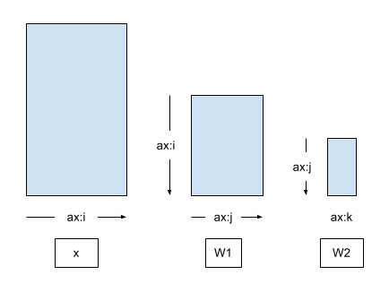

# Ejemplo simple DTENSORS

Este es un ejemplo simple de uso de DTENSORS, para probarlo debemos realizar los siguientes pasos.

1. Conectarse a FT3
2. Entrar en un nodo interactivo con 2 GPUs
3. Configurar el entorno mytf
4. Ejecuta el script dataparallel.py

```bash
ssh tusuario@ft3.cesga.es
source $STORE/Cesga2023Courses/pytorch_dist/scripts/interactive_1node_2gpus.sh
source $STORE/mytf/bin/activate
python dataparallel.py
```

El código ejecutado está basado en el [siguiente ejemplo](https://www.tensorflow.org/tutorials/distribute/dtensor_ml_tutorial).
Implementa una aplicación de *Sentiment Analysis* utilizando *DTENSORS*. Para ello:
- Crea un *Dataset* a través de datos compuestos por texto tokenizado.
- Construye un modelo *MLP* con capas especiales de tipo *Dense* y *BatchNorm* definidas a través de *tf.Module* que se usan para registrar las variables de inferencia.

Inspeccionamos ahora partes clave del código relacionadas con el entrenamiento distribuido. Por ejemplo, la definición de una capa *Dense*
en base a *DTensors*. La operación global a realizar en esta capa es $y_i=\sigma (\sum_{i}W_{ij}+b_j)$, donde $*x_i$ son las entradas de la capa,
$w_{ij}$ son los pesos y $b_j$ son las bias. La distribución (*sharding*) de este cómputo se realiza del siguiente modo:

- La operación Matrix-Dot-Product $t_j=\sigma (\sum_{i}W_{ij})$ se distribuye a lo largo del bucle de la $i$.
- La suma de las bias $y_j=t_j+b_j$ se distribuye a través del bucle de la $j$.

https://github.com/diegoandradecanosa/Cesga2023Courses/blob/8974e0d39b4acd68cca64bddfb82b6bf70c4dfde/tf_dist/TF/006DTENSORS/dataparallel.py#L35-L63

En concreto, es importante inspeccionar la parte donde se definen los pesos en base a *DTensors*. Fijémonos que se utiliza como layout, 
una variable *weight_layout* que se recibe como parámetro del constructor. Si miramos, la instanciación de la capa *Dense* vemos que dicho layout viene de un array
llamado *dense_layout* que a su vez recibe el contructor de la red *MLP*. Dichos layout, y el de los pesos son los siguientes (tal y como se le pasan al constructor de MLP).

```python
[dtensor.Layout([dtensor.UNSHARDED, dtensor.UNSHARDED], mesh),
             dtensor.Layout([dtensor.UNSHARDED, dtensor.UNSHARDED], mesh),]
```

El layout de las bias el igual al del último eje de los pesos

```python
    bias_layout = weight_layout.delete([0])
```

https://github.com/diegoandradecanosa/Cesga2023Courses/blob/8974e0d39b4acd68cca64bddfb82b6bf70c4dfde/tf_dist/TF/006DTENSORS/dataparallel.py#L43-L48

sucede lo mismo con los bias

https://github.com/diegoandradecanosa/Cesga2023Courses/blob/8974e0d39b4acd68cca64bddfb82b6bf70c4dfde/tf_dist/TF/006DTENSORS/dataparallel.py#L56-L57

También es importante inspeccionar la definición de la capa *BatchNorm*. 
Su constructor no recibe un parámetro *Layout*. Esto sucede porque esta capa no tiene variables internas, simplemente transforma las entradas que recibe. En todo caso, usa *DTensors* también
porque su entrada *x* tiene este tipo que representa el batch global.

https://github.com/diegoandradecanosa/Cesga2023Courses/blob/8974e0d39b4acd68cca64bddfb82b6bf70c4dfde/tf_dist/TF/006DTENSORS/dataparallel.py#L66-L76

La definición de la arquitectura del modelo que las combina *MLP*. 


https://github.com/diegoandradecanosa/Cesga2023Courses/blob/8974e0d39b4acd68cca64bddfb82b6bf70c4dfde/tf_dist/TF/006DTENSORS/dataparallel.py#L82-L97

 La siguiente figura muestra las correspondencias de ejes entre la entrada *x* y los pesos
de las dos capas denses *w1* y *w2*. En este caso no hay ningún tipo de distribución (*sharding*)




El modelo tiene una arquitectura secuencial con $Dense -> BatchNorm -> Dense$. Así que la estrategia de distribución es hacer la distribución por el ejec común $j$.

$$
\mathsf{Layout}[{W_{1,ij} }; i, j] = \left[\hat{i}, \hat{j}\right] \\
\mathsf{Layout}[{W_{2,jk} }; j, k] = \left[\hat{j}, \hat{k} \right]
$$

Más adelante, creamos una Mesh con los dispositivos disponibles (en este caso 2 GPUs)

https://github.com/diegoandradecanosa/Cesga2023Courses/blob/8974e0d39b4acd68cca64bddfb82b6bf70c4dfde/tf_dist/TF/006DTENSORS/dataparallel.py#L99

Primero, probamos el modelo replicándolo totalmente en todos los dispositivos

https://github.com/diegoandradecanosa/Cesga2023Courses/blob/8974e0d39b4acd68cca64bddfb82b6bf70c4dfde/tf_dist/TF/006DTENSORS/dataparallel.py#L101-L106

La función *repack_local_tensor* mueve los datos a los dispositivos.

https://github.com/diegoandradecanosa/Cesga2023Courses/blob/8974e0d39b4acd68cca64bddfb82b6bf70c4dfde/tf_dist/TF/006DTENSORS/dataparallel.py#L109-L136

Inspeccionémosla más en detalle. La función *tf.data* carga los datos en la memoria principal del dispositivo *host*. Es necesario, mover estos datos explícitamente 
a los dispositivos aceleradores. Dicho se envío se hace a través del uso de la función *dtensor.pack*.

## Paralelismo a nivel del datos

El paralelismo a nivel de datos se realiza del siguiente modo:

- Todas las variables del modelo se replican en los *N* dispositivos disponibles
- Un batch (de entradas) global se distribuye en *N* batches (uno por réplica)
- Cada réplica del batch se entrena en cada dispositivo
- Se hace una reducción global de los gradientes, y los gradientes globales son aplicados de forma consistente sobre todas las réplicas.

La siguiente figura muestra cómo esta estrategia de distribución se implementa con las entradas y los pesos de las dos capas densas.


https://github.com/diegoandradecanosa/Cesga2023Courses/blob/8974e0d39b4acd68cca64bddfb82b6bf70c4dfde/tf_dist/TF/006DTENSORS/dataparallel.py#L138-L142

Aquí vemos cómo creamos una mes con los dispositivos disponibles y replicamos (*UNSHARDED*) los datos de los tensores a lo largo de los dispositivos.

Los datos de entrenamiento sí que son distribuidos a lo largo de la dimensión *batch* en forma de *DTensors*.


El paso de entrenamiento *train_step* se encapsura en forma de *tf.function* para indicar que su ejecución debe ser registrada por el *TensorFlow Graph*.
Hay que observar que el código relacionado con *DTensors* no está presente aquí.

https://github.com/diegoandradecanosa/Cesga2023Courses/blob/8974e0d39b4acd68cca64bddfb82b6bf70c4dfde/tf_dist/TF/006DTENSORS/dataparallel.py#L157-L174

El bucle de entrenamiento también no contiene ninguna indicación del uso de DTensors salvo la llamada a *repack_batch* al principio de cada paso

https://github.com/diegoandradecanosa/Cesga2023Courses/blob/8974e0d39b4acd68cca64bddfb82b6bf70c4dfde/tf_dist/TF/006DTENSORS/dataparallel.py#L191-L204

## Paralelismo a nivel de modelo

El código para implementar paralelismo a nivel de modelo en el ejemplo anterior es muy similar al que hemos visto. Su ejecución requiere unos pasos similares al ejemplo anterior.

```bash
ssh tusuario@ft3.cesga.es
source $STORE/Cesga2023Courses/pytorch_dist/scripts/interactive_1node_2gpus.sh
source $STORE/mytf/bin/activate
python modelparallel.py
```

La siguiente figure muestra la estrategia de distribución asociada a este caso.


Como tenemos 2 dispositivos, vamos a tener una dimensión *batch* de tamaño 1 y vamos a crear una nueva dimensión *model* de tamaño 2. La idea del paralelismo de modelo se basa en distribuir cada réplica del modelo
a través de varios dispositivos:

- Hay una réplica del modelo, pero podría haber varias que se repartirían los *batch* del conjunto de entrenamiento.
- Los dispositivos que componen una misma copia del modelo reciben  datos de entrenamiento replicados.

En las siguiente líneas vemos cambios significativos respecto al código anterior. Creamos una *mesh* con 2 dimensiones diferentes y 
definimos que dimensiones de cada estructura están distribuidas y cuales no.

https://github.com/diegoandradecanosa/Cesga2023Courses/blob/034de6f8e328cdebd9b6c5b2062993c1781b8c2a/tf_dist/TF/006DTENSORS/modelparallel.py#L142-L144

El resto del código se puede mantener igual y seguiría funcionando para este caso.

Puedes inspeccionar también las modificaciones para incrementar las fuentes de paralelismo usando [paralelismo espacial](https://www.tensorflow.org/tutorials/distribute/dtensor_ml_tutorial#spatial_parallel_training) (*spatial*)


